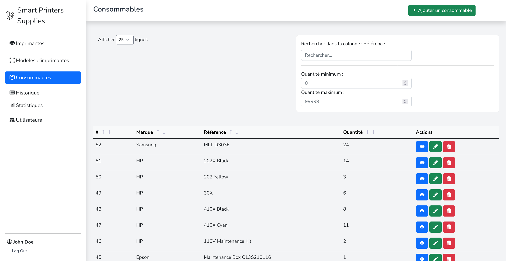

  <h2 align="center">Smart Printers Supplies</h2>

  

    The best way to manage your printer supplies!
  

## About The Project

  

Smart Printers Supplies is a web application for companies that have printers and need to manage their supplies. Your technicians can easily add new supplies and keep track of the ones that are running low. You can also add new printers and assign supplies to them. When a supply, like toner, is used up in a printer, the system will keep track of the usage history.

This application is intended to simplify the process of managing printer supplies. It is also a great way to keep track of the usage history of your supplies.

This project was created as a personal project to learn more about Laravel and REST API. It is in a development state and is not recommended for production use.

## Built With
This application is built with the following technologies:
* [![Laravel][Laravel.com]][Laravel-url]
* [![Bootstrap][Bootstrap.com]][Bootstrap-url]
* [![JQuery][JQuery.com]][JQuery-url]

## Getting Started
### Installation
Follow the installation instructions in the [installation.md](installation.md) file.
This will guide you through the installation of a development environment.

### Usage
After the installation, you can access the application at http://localhost.
For more information about the usage of the application, please refer to the [usage.md](usage.md) file.

## Contact

Jérémie Arcidiacono - [LinkedIn][linkedin-url] - jeremie@arcidiacono.dev

Project Link: [https://github.com/jeremie-arcidiacono/SmartPrintersSupplies](https://github.com/jeremie-arcidiacono/SmartPrintersSupplies)

<!-- MARKDOWN LINKS & IMAGES -->
[product-screenshot]: images/screenshot-supplies-page.png
[linkedin-url]: https://www.linkedin.com/in/jeremie-arcidiacono
[Laravel.com]: https://img.shields.io/badge/Laravel-FF2D20?style=for-the-badge&logo=laravel&logoColor=white
[Laravel-url]: https://laravel.com
[Bootstrap.com]: https://img.shields.io/badge/Bootstrap-563D7C?style=for-the-badge&logo=bootstrap&logoColor=white
[Bootstrap-url]: https://getbootstrap.com
[JQuery.com]: https://img.shields.io/badge/jQuery-0769AD?style=for-the-badge&logo=jquery&logoColor=white
[JQuery-url]: https://jquery.com 