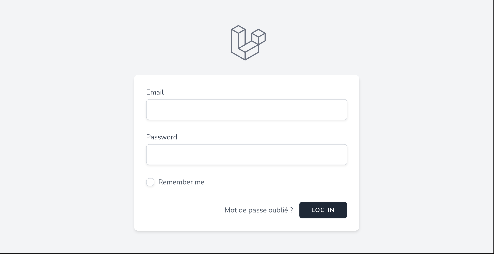
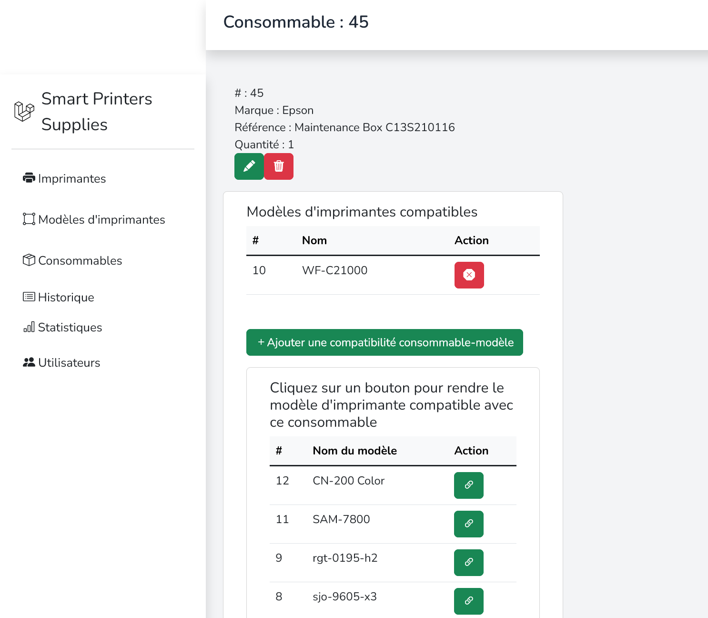
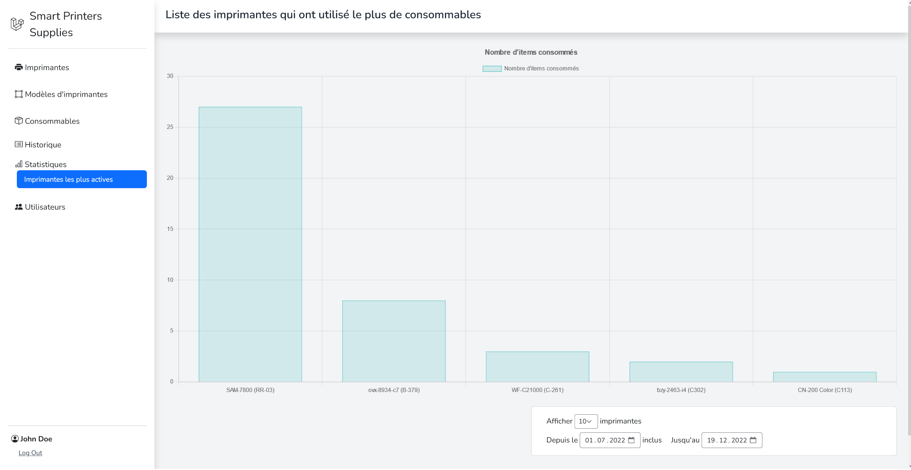
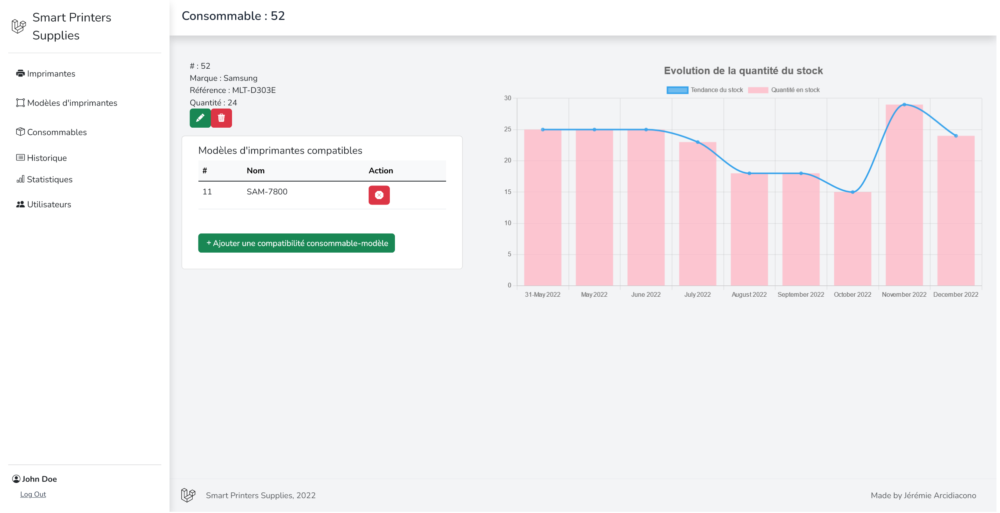

  <h2 align="center">Smart Printers Supplies</h2>

  

    Guide d'utilisation de l'application
  

  

    Français
  

 
 

<!-- TABLE OF CONTENTS -->

    
Table des matières

    <ol>
        <li><a href="#premiers-pas">Premiers pas</a></li>
        <li><a href="#créer-une-imprimante-et-ses-consommables">Créer une imprimante et ses consommables</a></li>
        <li><a href="#utiliser-un-consommable-sur-une-imprimante">Utiliser un consommable sur une imprimante</a></li>
        <li><a href="#consulter-les-interventions-réalisées">Consulter les interventions réalisées</a></li>
        <li><a href="#consulter-les-statistiques">Consulter les statistiques</a></li>
        <li>
            <a href="#gestion-des-utilisateurs">Gestion des utilisateurs</a>
            <ul>
                <li><a href="#créer-un-compte">Créer un compte</a></li>
                <li><a href="#désactiver-un-compte">Désactiver un compte</a></li>
            </ul>
        </li>
    </ol>

 

## Premiers pas
Pour utiliser le site web, il faudra vous connecter avec votre compte.
Puisque cette application est réservée aux personnes faisant partie du service informatique/technique de l'entreprise, il n'y a pas de système d'inscription. Seul un utilisateur ayant déjà un compte peut créer un nouveau compte.
 

 

## Créer une imprimante et ses consommables
1. Avant de pouvoir créer des imprimantes, il faut créer un modèle d'imprimante. Pour ce faire, il faut aller dans le menu "Modèles d'imprimantes" et cliquer sur le bouton "Créer un modèle d'imprimante"
2. Créez ensuite une imprimante en allant dans le menu "Imprimantes" et en cliquant sur le bouton "Créer une imprimante"
3. Pour créer un consommable, il faut aller dans le menu "Consommables" et cliquer sur le bouton "Créer un consommable"
4. Pour rendre un consommable utilisable, il faut aller sur la page de détail du consommable et cliquer sur le bouton "Ajouter une compatibilité consommable/modèle". Ainsi, chaque imprimante de ce modèle pourra utiliser ce consommable.
 

 

## Utiliser un consommable sur une imprimante
Rendez-vous sur la page de détail d'une imprimante. Vous y retrouverez la liste des consommables utilisables sur cette imprimante.

 

## Consulter les interventions réalisées
Rendez-vous dans la page "Consommables" du menu "Historique". Vous y retrouverez la liste des interventions réalisées sur les imprimantes. Les lignes de la liste qui ne possèdent pas d'imprimante sont des interventions réalisées sur le stock de consommables (par exemple, un rachat de consommable).

 

## Consulter les statistiques
- Visualisez les imprimantes qui ont le plus de consommables utilisés en allant dans le menu "Statistiques" et en cliquant sur le bouton "Imprimantes les plus actives"
 
- Visualisez l'évolution du stock d'un consommable en allant sur la page de détail du consommable. Vous y retrouverez un graphique qui représente l'évolution du stock du consommable.
 
- Visualisez les consommables qui ont été utilisés sur une imprimante en allant sur la page de détail de l'imprimante.

 

## Gestion des utilisateurs
### Créer un compte
Pour créer un compte, il faut se connecter avec un compte existant. Une fois connecté, il faut aller dans le menu "Utilisateurs" et cliquer sur le bouton "Créer un compte". Il faut ensuite remplir le formulaire avec les informations de l'utilisateur à créer. Une fois le formulaire rempli, il faut cliquer sur le bouton "Créer".
### Désactiver un compte
Lorsqu'un utilisateur quitte l'entreprise, il faut désactiver son compte. Pour ce faire, il faut aller dans la page "Utilisateurs" et cliquer sur le bouton "Activer/Désactiver". Un compte inactif ne peut plus se connecter à l'application.

